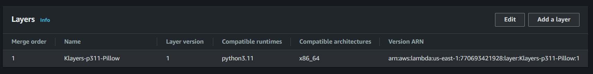
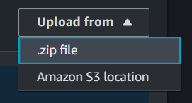

# Food Photography Demo - Photon

## Usage

You can test the image and prompt generation capabilities by calling one of the endpoints, either programmatically, or through a GUI like [insomnia](https://insomnia.rest/).

    Postman contains a bug that corrupts boundaries for large images, making the API unable to process the uploaded files.
    It is therefore recommended to use different software to test image generation capabilities.

## Limitations

### Current limitations

These limitations can be eliminated in production.

- Number of prompts generated: `3`
- Max. images per variation: `3`
- Results are sent in .a `.zip` format and cannot be viewed beforehand

### Possible improvements for production API:

These features can be added for the production version.

- Concurrent image generation (speeds up image generation by more than 300%)
- Image preprocessing, resizing
- Masking (the background and the plate shape doesn't change)
- `GPT-4` prompt generation (instead of 3.5 `turbo`)
- Authentication
- Persistent storage for generated images
- Presets for different foods, styles and scene setups
- Fine-tuned image model
- Feedback & image modification


## Endpoints

### 1. GET `/`:
- A simple endpoint to check if the application is running.
- Returns a greeting message.

### 2. POST `/prompts`:
Generates prompts for image generation based on input descriptions.
Accepts a prompt string as input through form data.

### 3. POST `/images`:
Generates images based on provided base image, generation prompt, and other parameters.
Accepts the following inputs:

`base_image`: An uploaded image file.

`prompt`: An image generation prompt.

`images_per_variation`: An integer for the number of images to generate per variation (1 to 3).

`creativity`: A float (0 to 1) to adjust the creativity of the generated images.

Returns a ZIP file containing generated images.


## Deployment

Right now, the deployment is done using Mangum and AWS Lambda using a zip file that contains the dependencies and the source code for the FastAPI application.



The Lambda uses a [Klayers](https://github.com/keithrozario/Klayers) layer for the Pillow library to provide the necessary binaries.
Layer's ARN: `arn:aws:lambda:eu-central-1:770693421928:layer:Klayers-p311-Pillow:1`

### Publish New Version
Navigate to the source folder of the project, then run:

    ./ci/build_lambda.sh

Wait until the build completes. Then, upload `lambda_function.zip` as the source code of the lambda function.



After adding the new source, publish a new version of the function.


## Local Setup

You should install the dependencies to a virtual environment by running:

    pip install -r requirements.txt

Then, you should also install Pillow locally:

    pip install Pillow

## Technical Documentation

### Project Structure
```plaintext
src
|---main.py
|---preprocessing
    |---resize.py
|---images
    |---generate.py
|---prompts
    |---generate.py
```


### Components Overview

#### 1. Main Application (`main.py`):

Initializes a FastAPI application and an AWS Lambda handler using Mangum.
Provides endpoints for generating prompts and images based on user input.
Includes utility functions for cleaning up generated files.

#### 2. Image Preprocessing (`src/preprocessing/resize.py`):

Defines a function to resize and crop images to specified dimensions while maintaining aspect ratio.

#### 3. Image Generation (`src/images/generate.py`):

- Utilizes the `Stable Diffusion XL` model from Stability.ai to generate images.
- Resizes and crops input images to allowed dimensions using a function from `src/preprocessing/resize.py`.
- Sends requests to the Stable Diffusion XL API with both initial image and text prompts to generate images.
- Specifies image generation parameters like image strength, step count, and style preset, which can be adjusted with a `creativity` parameter.
- Returns a list of paths to generated images.

Contains a function generate_images for generating images based on prompts and other parameters.

#### 4. Prompt Generation (src/prompts/generate.py):

Utilizes OpenAI GPT-3.5 to generate prompts for image generation based on input descriptions.